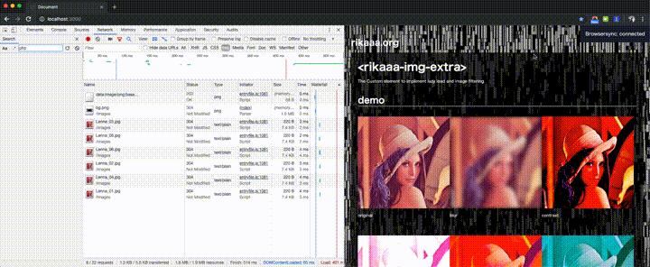

# `<rikaaa-img-extra>`
The Custom element to impliment lazy load and image filtering.



## Installation
```bash
#script
<!-- If you want to use the Custom Element with browser without not support Webcomponents. -->
<script src="https://unpkg.com/@webcomponents/webcomponentsjs@2.2.10/webcomponents-loader.js"></script>

<script src="rikaaa-img-extra.js"></script>
```

## Usage 
```bash
#HTML
<rikaaa-img-extra data-src="your image path" data-alt="your image alt text" size="000x000"></rikaaa-img-extra>
```

## Methods
- rikaaaimgextra.setRoot(Element)  
_Set a Element Node as View-port.This Element is equivalent with "root" parameter of Intersection Observer API._
```bash
var rikaaaimgextra = document.querySelector('rikaaa-img-extra');
    rikaaaimgextra.setRoot(document.querySelector('.maindemo'));
```

## Events
- addEventListener("load",callback)  
_The event will be triggered the custom element loaded._
```bash
Array.from(document.querySelectorAll("rikaaa-img-extra")).forEach(function (elem) {
    elem.addEventListener("load", function () {
        console.log("load");
    });
});
```

- addEventListener("loadImage,callback")  
_The event will be triggered image loaded._
```bash
Array.from(document.querySelectorAll("rikaaa-img-extra")).forEach(function(elem) {
    elem.addEventListener("loadImage", function() {
        console.log("image loaded");
    });
});
```


## Attributes
| Attribute | Require | Description |
----|----|----
| data-src ="string" | Require | The parameter to set image path by text string.. |
| size = "000x000" | Require | The parameter to set the size of image by text string.. For example, indication of '640x480' in case of width 640 pixel and height 480 pixel. |
| data-alt = "string" | | The parameter to set 'alt' of image by text string.. |
| loadtiming = "string" | | The parameter to set timing of image loading by text string. This parameter is equivalent with "rootMargin" parameter of Intersection Observer API.The default value is "100px 0px 100px 0px". The unit is pixel or percentage.|
| ~~offset = "integer"~~ | | ~~The parameter to set the margin between bottom end of viewport and The Custom element. In case, the margin of actual browser display shows smaller than the margin specified the image will be loaded. The unit is pixel. default value is 100.~~|
| blur = "float" | | The parameter to set the condition of blur by floating decimal point.|
| contrast = "float" | | The parameter to set the condition of contrast by floating decimal point. The minimum parameter is 1.0. |
| brightness = "float" | | The parameter to set the condition of brightness by floating decimal point. The minimum parameter is 0. |
| saturate = "float" | | The parameter to set the condition of saturate by floating decimal point. The minimum parameter is 0. |
| hue-rotate = "float" | | The parameter to set the condition of hue rotattion by floating decimal point. The unit is degree. The range is 0 to 360. |
| invert = "float" | | The parameter to set the condition of invert by floating decimal point. The range is 0 to 1.0. |
| opacity = "float" | | The parameter to set the condition of opacity by floating decimal point. The range is 0 to 1.0. |
| grayscale = "float" | | The parameter to set the condition of grayscale by floating decimal point. The range is 0 to 1.0. |
| sepia = "float" | | The parameter to set the condition of sepia by floating decimal point. The maximum parameter is 1.0. |

## Change Log
1. v1.1.0
    - The "offset" attribute removed.
    - The "loadtiming" attribute added.
    - The "setRoot" method added.

## Browser Support
- Google Chrome  
- Safari  
- Firefox  
- Edge  
- IE 11+ (When using polyfill)

## License
MIT © [rikaaa.org](http://rikaaa.org/)
